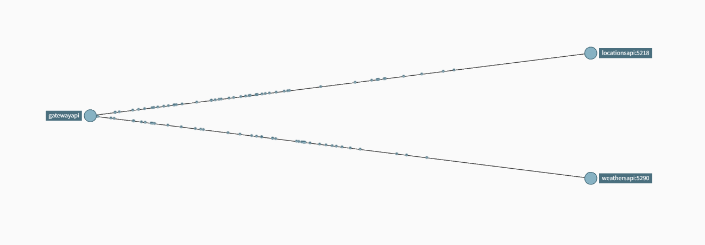

# Tracing & Monitoring with Opentelemetry and Prometheus

This demo contains client / server applications that use the
opentelemetry Go library for instrumentation and for sending telemetry data
to the opentelemetry collector.

The client periodically makes http calls to the server which
create client spans, server spans and metrics that track information like
number of http requests and latency.

This demo presents the typical flow of observability data with multiple
OpenTelemetry Collectors deployed:



- The client and server send data directly to the OTel Collector;

- The OTel Collector then sends the data to the appropriate backend, in this demo
 Jaeger, Zipkin, and Prometheus;

This demo uses `docker-compose` and by default runs against the 
`otel/opentelemetry-collector-contrib-dev:latest` image. To run the demo run:

```shell
docker-compose up -d
```

The demo exposes the following backends:

- Jaeger at http://localhost:16686
- Zipkin at http://localhost:9411
- Prometheus at http://localhost:9090 

- GatewayApi at http://localhost:5208/swagger/index.html
- Weathersapi at http://localhost:5290/swagger/index.html
- Locationsapi at http://localhost:5218/swagger/index.html

Notes:

- It may take some time for the application metrics to appear on the Prometheus
 dashboard;

To clean up any docker container from the demo run `docker-compose down`.
