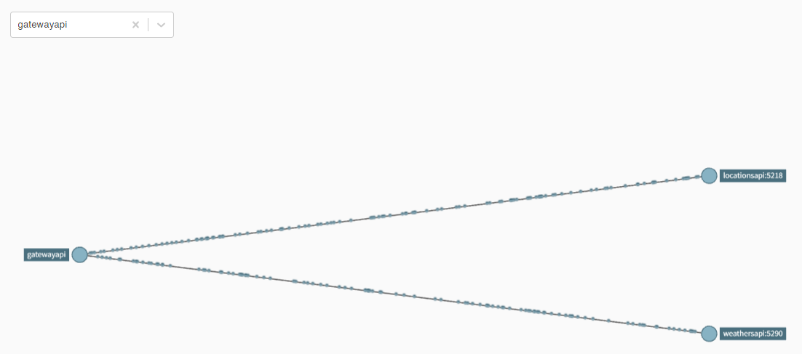
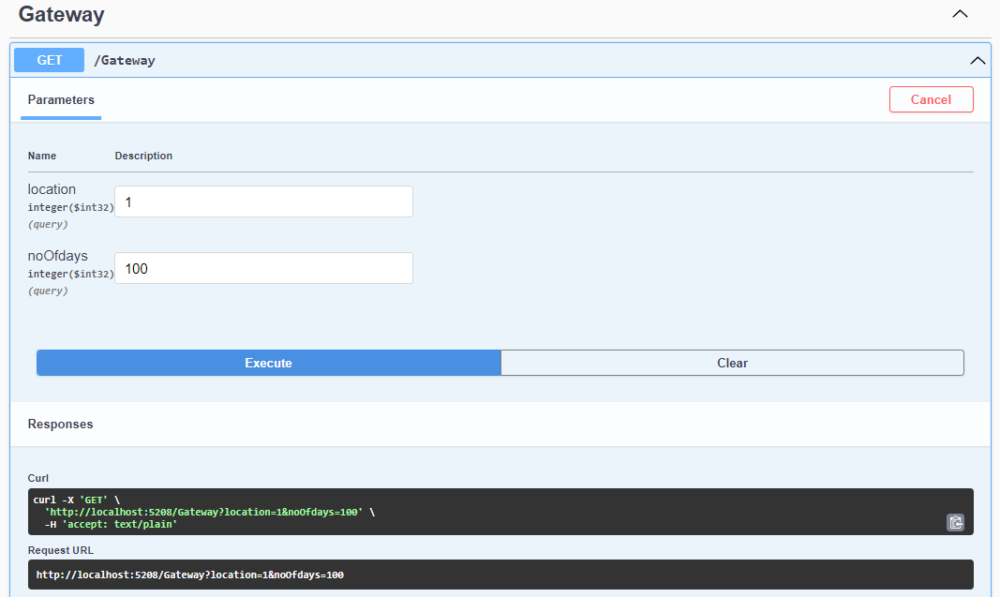
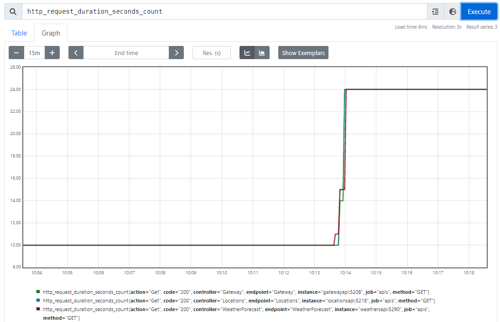
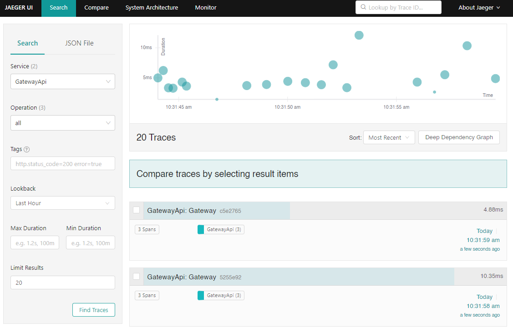
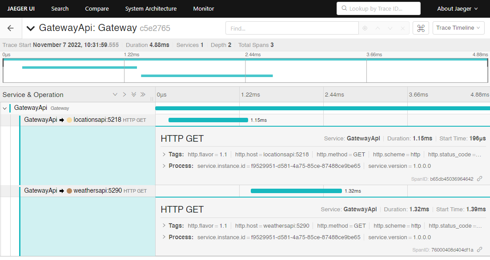

# Tracing & Monitoring with Opentelemetry and Prometheus

This demo contains client / server applications that use the
Opentelemetry .net library for instrumentation and for sending telemetry data
to the Opentelemetry collector based on the configuration from `otel-collector-config.yaml`.

The client periodically makes http calls to the server which
create client spans, server spans and metrics that track information like
number of http requests and latency.

The applications are also exposing standard dotnet/http Prometheus metrics that are automatically scrapped by Prometheus instance based on the targets specified in `prometheus.yml`.

This demo implements the following simple flow of microservices (visualization from Zipkin):



- The client and server send data directly to the OTel Collector;

- The OTel Collector then sends the data to the appropriate backend, in this demo
 Jaeger, Zipkin, and Prometheus;

- The client and server also send monitoring data directly to Prometheus agent;


This demo uses `docker-compose` and by default runs against the 
`otel/opentelemetry-collector-contrib-dev:latest` image. To run the demo run:

```shell
docker-compose up -d
```

The demo exposes the following backends:

- Jaeger at http://localhost:16686
- Zipkin at http://localhost:9411
- Prometheus at http://localhost:9090 

- GatewayApi at http://localhost:5208/swagger/index.html
- Weathersapi at http://localhost:5290/swagger/index.html
- Locationsapi at http://localhost:5218/swagger/index.html

Notes:

- It may take some time for the application metrics to appear on the Prometheus
 dashboard;

Running some tests:

- call the GatewayApi with location value 1 and noOfdays 100 to trigger a call to both Weathersapi and Locationsapi




- Prometheus, by default, will monitor standard metrics like a `http_request_duration_seconds_count` for each application:



- Jaeger will display the tracing information starting form the GatewayApi an the duration of the requests:



- Opening the details of any of the requests will give details about the response time and and the details of each individual calls to the other applications:




To clean up any docker container from the demo run `docker-compose down`.
